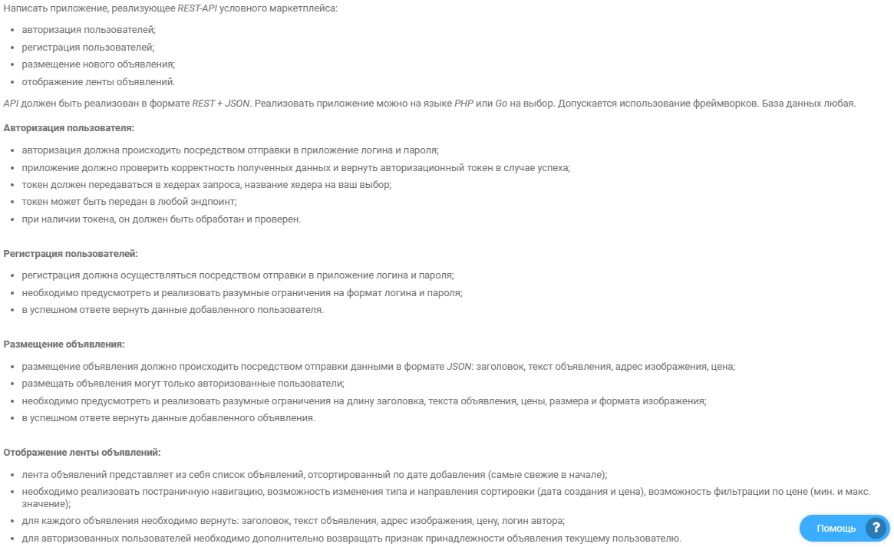

# Мини маркетплейс
## Запуск
    make up - собрать в docker + накатить миграции

## Использование
В папке [с запросами](/requests). Запускал через Goland
Последовательность:
* sign-up
* sign-in
* create-post
* posts

# Задание
